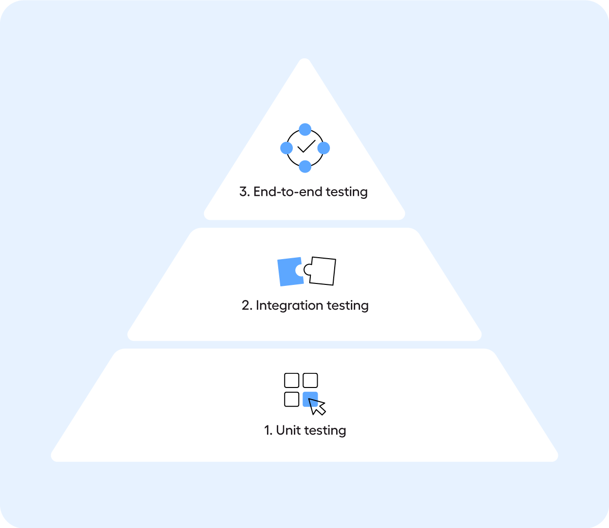

# Test Pyramid

The **test pyramid** is a concept in software testing that emphasizes a balanced and efficient testing strategy. It was introduced by Mike Cohn and provides guidance on how to structure automated tests across different levels of a system. The pyramid is divided into three main layers, with each layer representing a different type of test:

1. **Unit Tests (Base of the Pyramid)**:
   - **What they test**: Individual components or functions in isolation, usually at the code level.
   - **Characteristics**: 
     - Fast to run and easy to write.
     - Should be the most numerous in a test suite.
     - Focus on testing logic in small units of the application, like methods or classes.
   - **Purpose**: Provide quick feedback, helping to catch bugs early in the development process.

2. **Integration Tests (Middle of the Pyramid)**:
   - **What they test**: How different components of the system work together, such as the interaction between the database, APIs, and services.
   - **Characteristics**:
     - Slower than unit tests.
     - Involves testing multiple parts of the system together, but still narrower than end-to-end tests.
     - Verifies that components integrate and communicate correctly.
   - **Purpose**: Ensure that different modules or services are functioning properly when combined.

3. **End-to-End Tests (Top of the Pyramid)**:
   - **What they test**: The entire system from the user’s perspective, typically involving the full stack, including the UI, backend, and databases.
   - **Characteristics**:
     - Slowest to run and more complex to write and maintain.
     - Involves testing real-world user scenarios to validate the overall system’s functionality.
   - **Purpose**: Validate that the entire application works as expected, ensuring a seamless user experience.

### Key Concepts:
- **Inverted Pyramid Anti-Pattern**: If a test suite has too many end-to-end tests or integration tests compared to unit tests, it can become slow, brittle, and difficult to maintain.
- **Balance**: By having more unit tests than integration tests, and more integration tests than end-to-end tests, the test pyramid promotes a well-rounded testing approach that optimizes speed, feedback, and reliability.

The idea is to rely heavily on fast-running unit tests at the base, with a smaller number of more complex and slower tests at the higher levels.